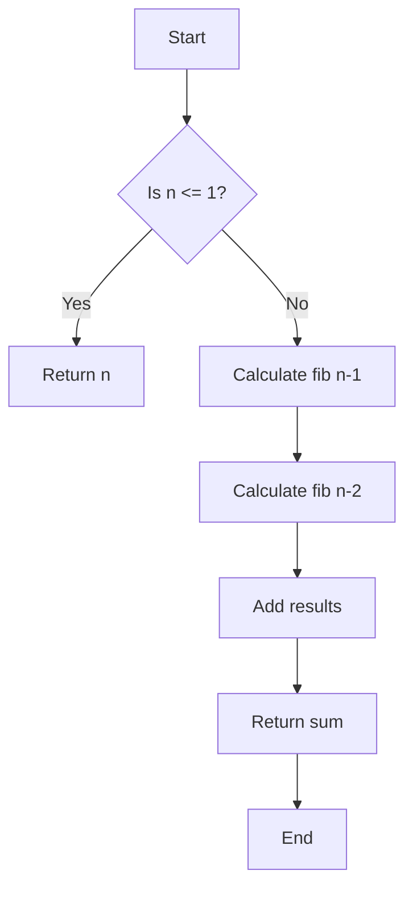
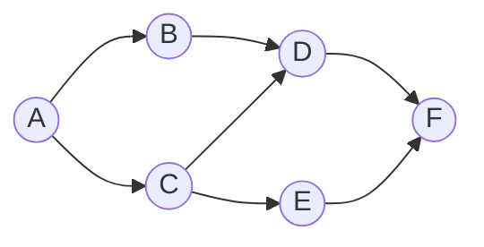
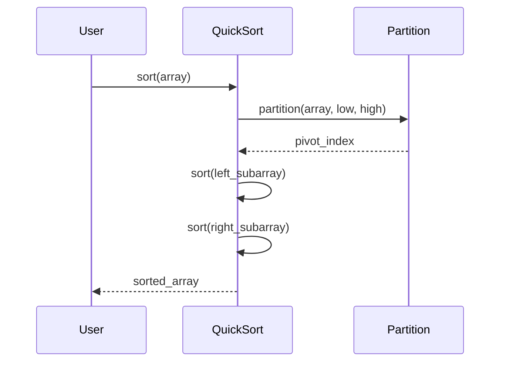
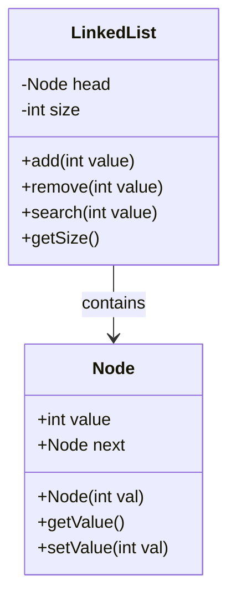

# Typora Feature Showcase & Guide by Claude

# Best Veiwed in Typora

**This README is designed to demonstrate Typora's features!** Open this file in Typora and toggle Source Code Mode (`⌘+/` or `Ctrl+/`) to see how each feature is created.

> 💡 **Viewing Tip:** In Typora, you can press `⌘+/` (Mac) or `Ctrl+/` (Windows/Linux) to toggle source code mode and see the markdown behind these examples.

---

## Table of Contents

[TOC]

---

## Installation

### macOS

```bash
# Using Homebrew
brew install --cask typora
```

Alternatively, download directly from [typora.io](https://typora.io/) and drag to Applications folder.

### Windows

1. Download the installer from [typora.io](https://typora.io/)
2. Run the `.exe` installer
3. Follow the installation wizard

### Linux

```bash
# Debian/Ubuntu
wget -qO - https://typora.io/linux/public-key.asc | sudo apt-key add -
sudo add-apt-repository 'deb https://typora.io/linux ./'
sudo apt-get update
sudo apt-get install typora

# Fedora/RHEL
sudo dnf install typora

# Arch Linux
yay -S typora
```

---

## Feature Showcase

### 1. Text Formatting

**Bold text** for emphasis, *italic text* for subtle emphasis, and ***bold italic*** for maximum impact.

You can also use ~~strikethrough~~ for corrections, ==highlight text== for important parts, and `inline code` for variable names.

<u>Underlined text</u> is also supported!

### 2. Mathematical Expressions

#### Inline Math

The quadratic formula is $x = \frac{-b \pm \sqrt{b^2-4ac}}{2a}$, and Euler's identity states that $e^{i\pi} + 1 = 0$.

For algorithms, we often use complexity notation: $O(n)$, $O(n \log n)$, $\Theta(n^2)$, $\Omega(n)$.

#### Block Math

**Merge Sort Complexity Analysis:**
$$
T(n) = 2T(n/2) + O(n)
$$

**Master Theorem:**
$$
T(n) = aT(n/b) + f(n)
$$

**Summations:**
$$
\sum_{i=1}^{n} i = \frac{n(n+1)}{2}
$$

**Matrix Operations:**
$$
\begin{bmatrix}
a & b \\
c & d
\end{bmatrix}
\times
\begin{bmatrix}
x \\
y
\end{bmatrix}
=
\begin{bmatrix}
ax + by \\
cx + dy
\end{bmatrix}
$$

**Dynamic Programming Recurrence:**
$$
dp[i][j] = \begin{cases}
0 & \text{if } i = 0 \text{ or } j = 0 \\
dp[i-1][j-1] + 1 & \text{if } s_1[i] = s_2[j] \\
\max(dp[i-1][j], dp[i][j-1]) & \text{otherwise}
\end{cases}
$$

### 3. Code Blocks with Syntax Highlighting

#### Python Algorithm Example

```{.python .numberlines}
def merge_sort(arr):
    """
    Merge sort implementation with O(n log n) time complexity.
    Space complexity: O(n)
    """
    if len(arr) <= 1:
        return arr

    mid = len(arr) // 2
    left = merge_sort(arr[:mid])
    right = merge_sort(arr[mid:])

    return merge(left, right)

def merge(left, right):
    result = []
    i = j = 0

    while i < len(left) and j < len(right):
        if left[i] <= right[j]:
            result.append(left[i])
            i += 1
        else:
            result.append(right[j])
            j += 1

    result.extend(left[i:])
    result.extend(right[j:])
    return result
```

#### C++ Implementation

```cpp
#include <vector>
#include <algorithm>

class Solution {
public:
    // Binary search implementation
    int binarySearch(vector<int>& nums, int target) {
        int left = 0, right = nums.size() - 1;

        while (left <= right) {
            int mid = left + (right - left) / 2;
            if (nums[mid] == target) {
                return mid;
            } else if (nums[mid] < target) {
                left = mid + 1;
            } else {
                right = mid - 1;
            }
        }
        return -1;
    }
};
```

#### JavaScript Example

```javascript
// Depth-First Search on a graph
function dfs(graph, node, visited = new Set()) {
    if (visited.has(node)) return;

    visited.add(node);
    console.log(node);

    for (const neighbor of graph[node]) {
        dfs(graph, neighbor, visited);
    }
}
```

### 4. Tables

#### Algorithm Complexity Comparison

| Algorithm | Best Case | Average Case | Worst Case | Space Complexity |
|-----------|:---------:|:------------:|:----------:|:----------------:|
| Quick Sort | $O(n \log n)$ | $O(n \log n)$ | $O(n^2)$ | $O(\log n)$ |
| Merge Sort | $O(n \log n)$ | $O(n \log n)$ | $O(n \log n)$ | $O(n)$ |
| Heap Sort | $O(n \log n)$ | $O(n \log n)$ | $O(n \log n)$ | $O(1)$ |
| Bubble Sort | $O(n)$ | $O(n^2)$ | $O(n^2)$ | $O(1)$ |
| Insertion Sort | $O(n)$ | $O(n^2)$ | $O(n^2)$ | $O(1)$ |

#### Keyboard Shortcuts Reference

| Action | macOS | Windows/Linux |
|:-------|:-----:|:-------------:|
| Bold | `⌘ + B` | `Ctrl + B` |
| Italic | `⌘ + I` | `Ctrl + I` |
| Underline | `⌘ + U` | `Ctrl + U` |
| Code | `⌘ + Shift + K` | `Ctrl + Shift + K` |
| Code Block | `⌘ + Option + C` | `Ctrl + Alt + C` |
| Math Block | `⌘ + Option + B` | `Ctrl + Alt + B` |
| Heading 1-6 | `⌘ + 1-6` | `Ctrl + 1-6` |
| Quote | `⌘ + Shift + Q` | `Ctrl + Shift + Q` |
| Source Mode | `⌘ + /` | `Ctrl + /` |

### 5. Lists

#### Unordered Lists

- Breadth-First Search (BFS)
  - Uses a queue data structure
  - Explores nodes level by level
  - Optimal for shortest path in unweighted graphs
- Depth-First Search (DFS)
  - Uses a stack (or recursion)
  - Explores as far as possible along each branch
  - Applications:
    - Topological sorting
    - Detecting cycles
    - Finding connected components

#### Ordered Lists

1. **Understand the problem**
   1. Read carefully
   2. Identify input/output
   3. Note constraints
2. **Plan your approach**
   1. Consider time complexity requirements
   2. Think about edge cases
   3. Choose appropriate data structures
3. **Implement the solution**
4. **Test thoroughly**
5. **Optimize if needed**

#### Task Lists

- [x] Implement merge sort algorithm
- [x] Add time complexity analysis
- [x] Write test cases
- [ ] Optimize space complexity
- [ ] Add visualization
- [ ] Document edge cases

### 6. Block Quotes

> **Important Note:**
> Always analyze the time and space complexity of your algorithms before submitting homework!

> **Donald Knuth:**
> "Premature optimization is the root of all evil."

> 🚨 **Warning:**
> This algorithm has $O(2^n)$ time complexity. It will be too slow for large inputs!

### 7. Diagrams with ASCII Art

#### Binary Search Tree

```
         50
       /    \
      30     70
     /  \   /  \
   20   40 60  80
  /              \
 10              90
```

#### Array Visualization

```
Index:  0   1   2   3   4   5   6   7
       ┌───┬───┬───┬───┬───┬───┬───┬───┐
Array: │ 3 │ 7 │ 1 │ 9 │ 2 │ 8 │ 5 │ 4 │
       └───┴───┴───┴───┴───┴───┴───┴───┘
               ↑
             Target
```

#### Linked List

```
┌───┬───┐    ┌───┬───┐    ┌───┬───┐    ┌───┬───┐
│ 1 │ ●─┼───→│ 2 │ ●─┼───→│ 3 │ ●─┼───→│ 4 │ ╳ │
└───┴───┘    └───┴───┘    └───┴───┘    └───┴───┘
  Head                                     Tail
```

### 8. Horizontal Rules

Use horizontal rules to separate sections:

---

### 9. Footnotes

Dijkstra's algorithm[^1] is used for finding shortest paths in weighted graphs. The Floyd-Warshall algorithm[^2] can find shortest paths between all pairs of vertices.

[^1]: Edsger W. Dijkstra, "A note on two problems in connexion with graphs", 1959
[^2]: Robert W. Floyd, "Algorithm 97: Shortest Path", 1962

### 10. Links and References

- [Typora Official Documentation](https://support.typora.io/)
- [Markdown Guide](https://www.markdownguide.org/)
- [LaTeX Math Symbols](https://www.overleaf.com/learn/latex/List_of_Greek_letters_and_math_symbols)
- [Typora Themes Gallery](https://theme.typora.io/)
- [Big-O Cheat Sheet](https://www.bigocheatsheet.com/)

### 11. Mermaid Diagrams

#### Flowchart Example



#### Graph Visualization



#### Algorithm Steps



#### Class Diagram



### 12. Common Math Symbols Quick Reference

| Symbol | LaTeX Code | Rendered |
|--------|------------|----------|
| Summation | `\sum_{i=1}^{n}` | $\sum_{i=1}^{n}$ |
| Product | `\prod_{i=1}^{n}` | $\prod_{i=1}^{n}$ |
| Integral | `\int_{a}^{b}` | $\int_{a}^{b}$ |
| Limit | `\lim_{x \to \infty}` | $\lim_{x \to \infty}$ |
| Square root | `\sqrt{x}` | $\sqrt{x}$ |
| Fraction | `\frac{a}{b}` | $\frac{a}{b}$ |
| Big O | `O(n)` | $O(n)$ |
| Theta | `\Theta(n)` | $\Theta(n)$ |
| Omega | `\Omega(n)` | $\Omega(n)$ |
| Less/Equal | `\leq` | $\leq$ |
| Greater/Equal | `\geq` | $\geq$ |
| Not equal | `\neq` | $\neq$ |
| Infinity | `\infty` | $\infty$ |
| For all | `\forall` | $\forall$ |
| Exists | `\exists` | $\exists$ |
| Element of | `\in` | $\in$ |
| Subset | `\subseteq` | $\subseteq$ |
| Union | `\cup` | $\cup$ |
| Intersection | `\cap` | $\cap$ |
| Arrow | `\rightarrow` | $\rightarrow$ |
| Bidirectional | `\leftrightarrow` | $\leftrightarrow$ |

---

## Example Homework Solution Template

### Problem 1: Longest Common Subsequence

#### Problem Statement

Given two strings `text1` and `text2`, return the length of their longest common subsequence. If there is no common subsequence, return 0.

**Example:**
```
Input: text1 = "abcde", text2 = "ace"
Output: 3
Explanation: The longest common subsequence is "ace" with length 3.
```

#### Approach

- [x] Identify this as a dynamic programming problem
- [x] Define DP state: `dp[i][j]` = LCS length of `text1[0..i]` and `text2[0..j]`
- [x] Formulate recurrence relation
- [x] Implement bottom-up solution

#### Solution

**Recurrence Relation:**
$$
dp[i][j] = \begin{cases}
0 & \text{if } i = 0 \text{ or } j = 0 \\
dp[i-1][j-1] + 1 & \text{if } \text{text1}[i-1] = \text{text2}[j-1] \\
\max(dp[i-1][j], dp[i][j-1]) & \text{otherwise}
\end{cases}
$$

**Implementation:**

```python
def longestCommonSubsequence(text1: str, text2: str) -> int:
    """
    Dynamic programming solution for LCS problem.

    Time Complexity: O(m * n) where m = len(text1), n = len(text2)
    Space Complexity: O(m * n) for the DP table
    """
    m, n = len(text1), len(text2)

    # Initialize DP table
    dp = [[0] * (n + 1) for _ in range(m + 1)]

    # Fill DP table
    for i in range(1, m + 1):
        for j in range(1, n + 1):
            if text1[i-1] == text2[j-1]:
                dp[i][j] = dp[i-1][j-1] + 1
            else:
                dp[i][j] = max(dp[i-1][j], dp[i][j-1])

    return dp[m][n]
```

#### Complexity Analysis

| Metric | Complexity | Explanation |
|--------|-----------|-------------|
| Time | $O(m \times n)$ | We fill an $m \times n$ table with constant time operations |
| Space | $O(m \times n)$ | DP table requires $m \times n$ space |
| Optimized Space | $O(\min(m, n))$ | Can use rolling array optimization |

#### Test Cases

```python
# Test Case 1: Basic example
assert longestCommonSubsequence("abcde", "ace") == 3

# Test Case 2: No common subsequence
assert longestCommonSubsequence("abc", "def") == 0

# Test Case 3: Identical strings
assert longestCommonSubsequence("abc", "abc") == 3

# Test Case 4: One empty string
assert longestCommonSubsequence("", "abc") == 0

# Test Case 5: Long strings
assert longestCommonSubsequence("AGGTAB", "GXTXAYB") == 4
```

**Result:** ✅ All tests passed!

---

## Typora Customization

### Themes

**Changing Themes:**
1. Open Typora
2. Go to `Preferences` → `Appearance` → `Themes`
3. Select from built-in themes or download custom ones

**Popular Themes for Academic Work:**
- **GitHub** - Clean, familiar interface
- **Night** - Dark mode for late-night coding
- **Academic** - Professional look for submissions
- **Newsprint** - Minimal, paper-like appearance
- **Vue** - Colorful and modern

### Math/LaTeX Configuration

1. Go to `Preferences` → `Markdown`
2. ✓ Enable "Inline Math"
3. ✓ Enable "Math Blocks"
4. ✓ Enable "Auto Numbering Math Equations" (optional)

### Export Settings

Export your homework in professional formats:

- **PDF** - Best for submissions (includes all formatting)
- **HTML** - For web viewing with full interactivity
- **Word** - For collaboration and track changes
- **LaTeX** - For academic publishing

**Export Tips:**
- Configure page margins in `Preferences` → `Export`
- Include diagrams by enabling "Export images" option
- Use "Include outline" for longer documents

---

## Tips for Homework Success

1. **Use consistent formatting** throughout your document
2. **Comment your code** to explain complex algorithms
3. **Show your work** with detailed complexity analysis
4. **Include test cases** with expected outputs
5. **Use visual aids** like tables and diagrams
6. **Proofread** before submitting
7. **Version control** - Commit to Git regularly
8. **Export to PDF** for final submission to preserve formatting

---

## Advanced Features

### HTML in Markdown

You can use HTML for additional styling when needed:

<div style="background-color: #f0f0f0; padding: 15px; border-left: 4px solid #0366d6;">
<b>Pro Tip:</b> Use Typora's outline view (toggle with <code>⌘+1</code> or <code>Ctrl+1</code>) to navigate long documents quickly!
</div>

### Emoji Support

Typora supports emojis: ✅ ❌ ⚠️ 💡 🚀 📊 📈 🎯 🔍 ⭐

### Subscript and Superscript

- Chemical formula: H~2~O
- Mathematical notation: x^2^ + y^2^ = r^2^

---

## Resources & Documentation

| Resource | Description | Link |
|----------|-------------|------|
| Typora Docs | Official documentation | [support.typora.io](https://support.typora.io/) |
| Markdown Guide | Comprehensive markdown reference | [markdownguide.org](https://www.markdownguide.org/) |
| LaTeX Math | Symbol reference | [Overleaf](https://www.overleaf.com/learn/latex/Mathematical_expressions) |
| Mermaid Diagrams | Diagram syntax guide | [mermaid.js.org](https://mermaid.js.org/) |
| Algorithm Visualizations | Interactive algorithm demos | [visualgo.net](https://visualgo.net/) |

---

## License

This homework repository is for educational purposes.

**Last Updated:** 2025-10-22

---

> **Remember:** Toggle Source Code Mode (`⌘+/` or `Ctrl+/`) to see how any feature in this document was created!
